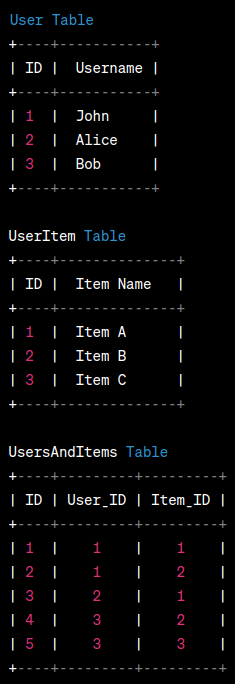

# Sequelize in MySQL (hasOne, hasMany, belongsTo, belongsToMany)

- This is a project which utilizes sequelize in NodeJS to interact with MySQL.
- ".env" file is created for the project. The content is given down below.
- hasOne, hasMany, belongsTo, belongsToMany table relations are covered here.

```javascript
DB = "mysql";
SCHEMA = "website";
ADMIN = "root";
PASS = "NEWPASSWORD";
HOST = "localhost";
PORT = 3306;
```

# Table Associations and Keywords

Associations are set for tables. All tables are given down below.

- ## One-to-One-Relation <br>

    **hasOne** and **belongsTo** associations for 2 models 
    - **User** 
    - **UserPass**

        Here are the keywords for related associations.
        - **Model-Association-for-hasOne-method**
            - **hasOne** association and related **set+UserPass**, **get+UserPass**, and  **create+UserPass** are covered.
            - **onDelete: "CASCADE"**, **onUpdate: "CASCADE** are covered.
            - Difference in between hasOne and belongsTo is covered when a foreignKey is updated. (Keyword: **hasOne-belongsTo-Difference-On-ForeignKeys**)
        - **Model-Association-for-belongsTo-method**
            - **belongsTo** association and related **setUser**, **getUser**, and **create+User** are covered.
            - **onDelete: "CASCADE"**, **onUpdate: "CASCADE** are covered.
            - Difference in between hasOne and belongsTo is covered when a foreignKey is updated. (Keyword: **hasOne-belongsTo-Difference-On-ForeignKeys**)

- ## One-to-Many-Relation <br>

    **hasMany** and **belongsTo** associations for 2 models 
    - **User** 
    - **UserPost**

        Here are the keywords for related associations.
        - **Model-Association-for-hasMany-method-for-One-to-Many-Relation**
            - **hasMany** association and related **add+UserPost+s**, **count+UserPost+s**, and **remove+UserPost** are covered.
            - Same methods of **hasOne** is also available for **hasMany**. These are mentioned as **set+UserPass**, **get+UserPass**, and  **create+UserPass**.
        - **Model-Association-for-belongsTo-method-for-One-to-Many-Relation**


- ## Many-to-Many-Relation <br>
    Keep in mind that, for many to many relations, and intermediary table is needed which is called "join table". Here is an example for many to many relation tables for User, UserItem and intermediary table.

    

    **hasMany** and **belongsToMany** associations for 2 models.
    - **User** 
    - **UserItem**
    - **UsersAndItems**, "Join Table" or intermediary table

        Here are the keywords for related associations.
        - **Model-Association-for-belongsToMany-method**

    